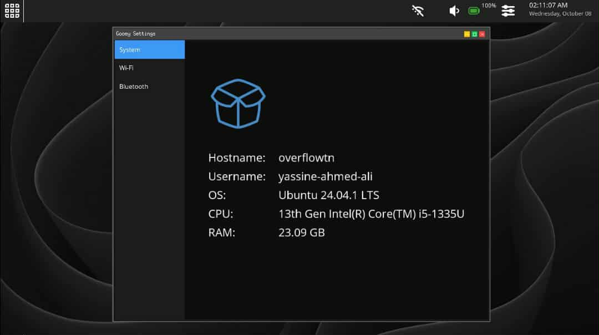
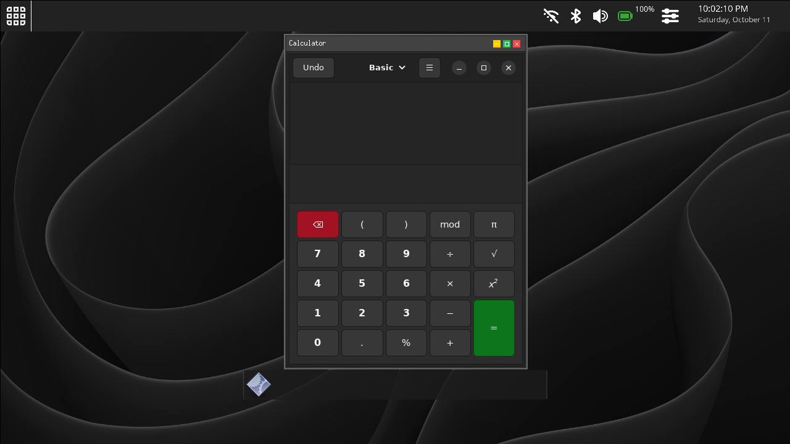

# GooeyDE

A lightweight Gooey based Linux desktop environment for Embedded Devices.





## How to Build

Download, compile and install Gooey from this 
<a href="https://github.com/BinaryInkTN/GooeyGUI">repo.</a>

```bash
# Clone GooeyDE's repository:
git clone https://github.com/BinaryInkTN/GooeyDE

# Build
cmake -S . -B build
```

## Architecture
At this early stage, the architecture is still under some changes. The idea is to have modular components communicating through DBus.